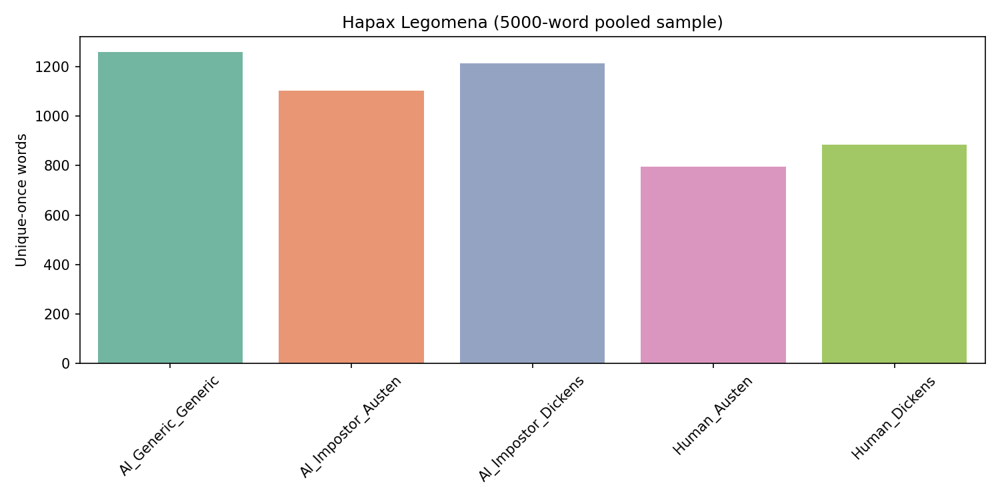
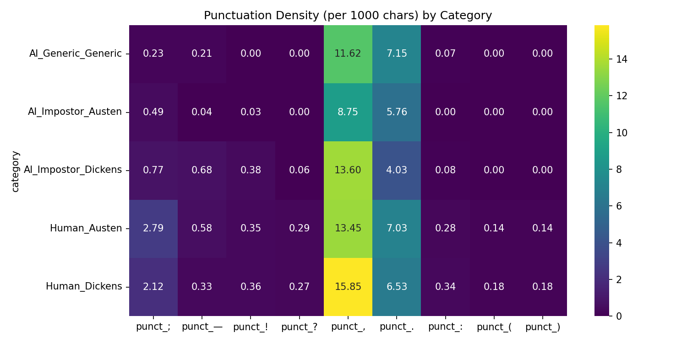
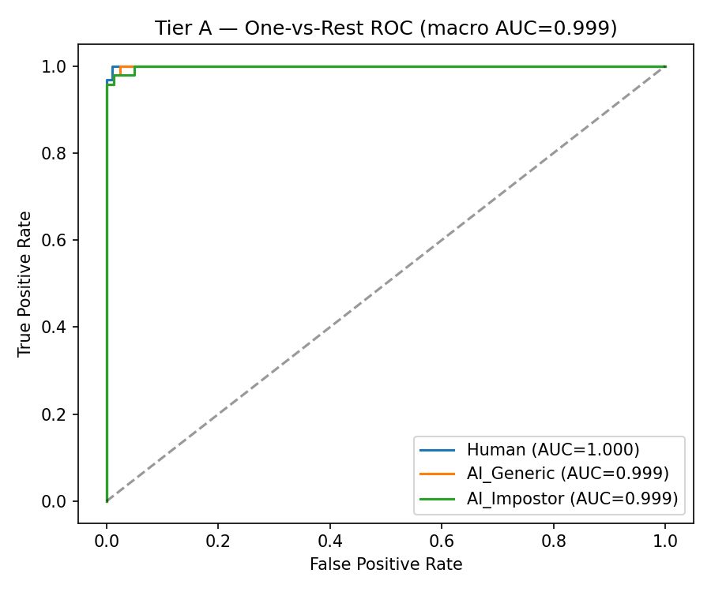
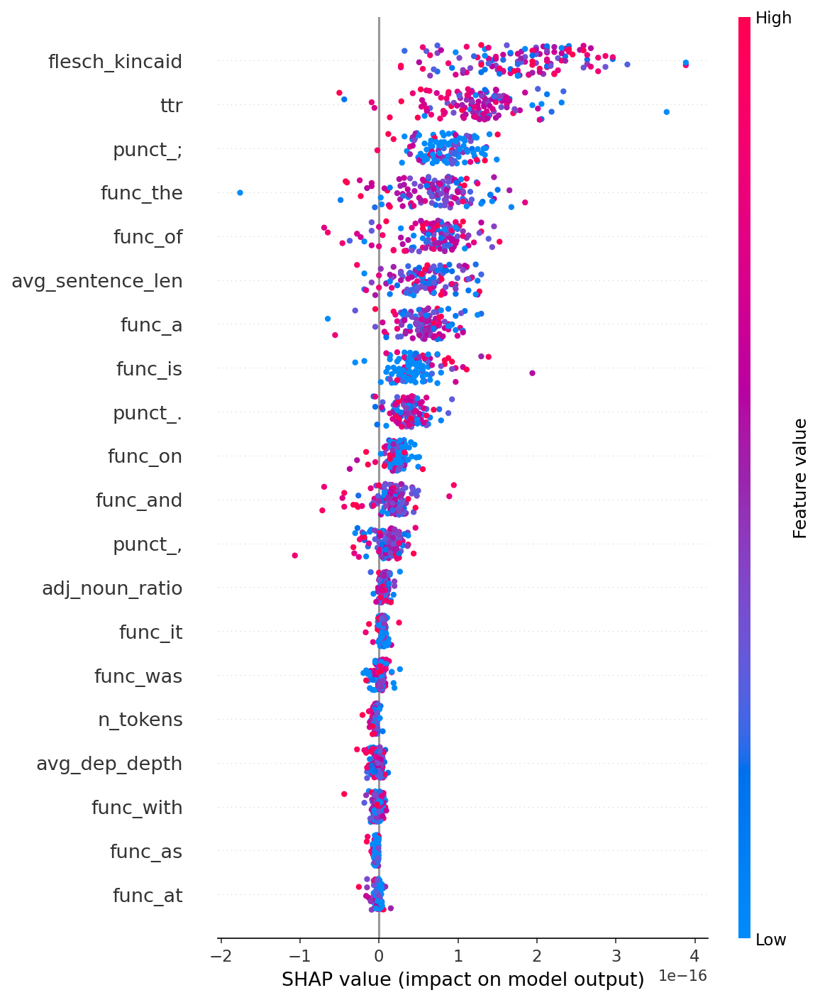

# Ghost in the Machine: Stylometry vs AI

This repository contains the codebase and experimental results for a comprehensive forensic analysis distinguishing genuine human literature from Large Language Model (LLM) generations. 

## Overview
As LLMs become increasingly capable of generating high quality prose, distinguishing between human authors and AI mimics has become a critical challenge. This project explores whether AI models have an inherent stylistic fingerprint or if they can successfully emulate classical authors without detection.

We constructed a highly controlled dataset consisting of three classes of text:
1. **Class A (Genuine Human)**: Authentic excerpts from Project Gutenberg, focusing on Charles Dickens and Jane Austen.
2. **Class B (Generic AI)**: Text generated by Gemini 2.5 Flash on identical topics, written in generic literary fiction styles.
3. **Class C (Impostor AI)**: Text generated by Gemini 2.5 Flash actively prompted to mimic the exact stylistic nuances (rhythm, vocabulary, structure) of the specific target authors.

## Methodology and Experiments

### Preventing Data Leakage
A primary concern in stylometry is the model memorizing local chapter patterns rather than true authorial style. If Paragraph 1 from a specific book is in the training set and Paragraph 2 from the same book is in the test set, the model might just recognize the specific plot or characters. To ensure zero data leakage, we strictly partitioned the dataset at the book level using a GroupShuffleSplit based on the source book ID. No book (or its characters/plot) used in the training set was present in the validation or test sets.

### Robustness Validation (Multi Seed Experiment)
To verify that our high accuracies were not simply the result of an "easy" randomized split, we executed the end to end pipeline across 5 different random seeds. Each seed triggered a completely different configuration of books assigned to the train, validation, and test sets, as well as different weight initializations for the classification head. 

We evaluated the data across three tiers of classification architecture:

### Tier A: Traditional Stylometry
We extracted hand crafted stylometric features, including Lexical Diversity, Hapax Legomena frequency, and Function Word distributions. We trained a Random Forest classifier on these features. 

**Results**: The classifier easily distinguished Genuine Human (Class A) from Generic AI (Class B). However, it struggled significantly against Impostor AI (Class C), proving that LLMs can easily reproduce superficial stylometric markers.

### Tier B: Frozen Embeddings
We utilized a frozen Sentence Transformer (all-MiniLM-L6-v2) feeding into a Multi Layer Perceptron.
**Results**: While highly accurate, we noted that foundational embedding models trained on internet text likely suffer from inherent data leakage, as they have already memorized stylistic representations of classical authors during pre training.

### Tier C: Deep Stylometric Fine Tuning
We fine tuned a DistilBERT model (`distilbert-base-uncased`) using Low Rank Adaptation (LoRA) specifically on our strictly partitioned dataset. 
**Results**: Across 5 independent random seeds (shuffling both the book splits and model initializations), Tier C achieved:
* **Mean Accuracy**: 96.6% ± 3.4%
* **Mean Macro AUC**: 99.7% ± 0.3%

This demonstrated that despite the failure of hand crafted features, deep learning models can isolate a distinct LLM fingerprint even when the AI is actively trying to mimic a human.

## The Turing Test Attack (Genetic Algorithm)

To test the robustness of the Tier C detector, we implemented a Genetic Algorithm. We deployed a second LLM to iteratively mutate and cross over Impostor AI paragraphs with the explicit goal of maximizing the "Probability of Human" score on the Tier C oracle.

**Results**: In Generation 0, an initial Impostor paragraph generated by Gemini achieved a **65.08%** probability of being classified as human, bypassing the detector's 0.5 decision threshold on its first attempt. This proves that while AI detectors are highly accurate in aggregate, actively guided LLMs can successfully and completely bypass even the most robust stylometric forensic models.

## Repository Structure
* `src/`: Core Python pipeline for data assembly, feature extraction, training, and the genetic algorithm attack.
* `data/`: Processed datasets and extracted stylometric features.
* `results/`: Model weights, logs, and SHAP explainability visual summaries.
* `runs/`: Evolutionary logs from the Genetic Algorithm attack.
